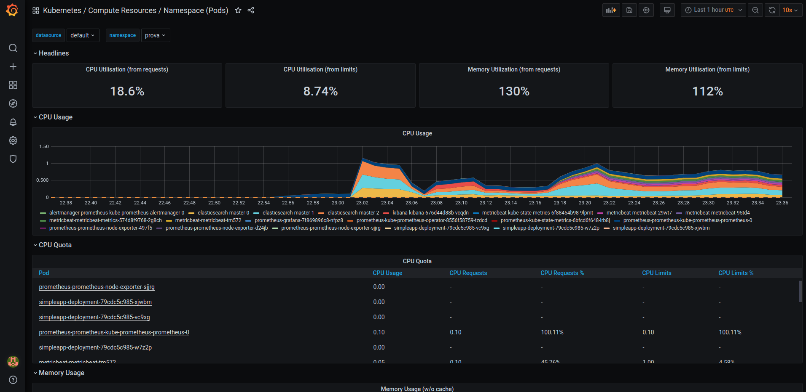
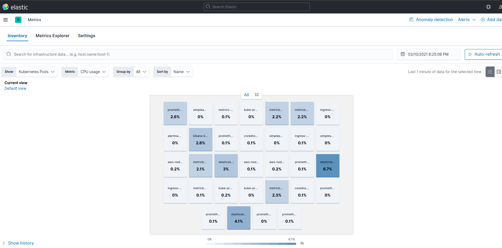
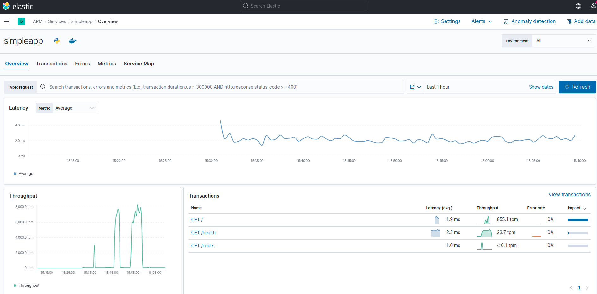
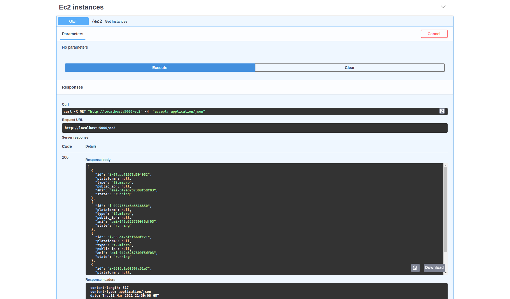

# simpleapp-test


## Deploy IaC

### Terraform:

```bash
## Initiate provider
terraform init
## Apply the modules
terraform apply
```

### Change Kubernetes context:

```bash
aws eks --region us-east-1 update-kubeconfig --name k8s-cluster
```

## Build API Image:

```bash
cd app/
docker build -t duran750/simpleapptest:v1
docker push duran750/simpleapptest:v1
```

## Kubernetes Manifests:

```bash
cd kubernetes/manifests
#Namespace: 
kubectl create -f ns.yaml && \
#ConfigMap:
kubectl create -f simpleapp-cm.yaml && \ 
#Deployment: 
kubectl create -f simpleapp.yaml && \ 
#Service
kubectl create -f simpleapp-svc.yaml && \ 
#Ingress Controller
kubectl create -f challenge-ingress.yaml 
          
```

### K8s Features:


```bash
# Deploy Nginx ingress controller
kubectl apply -f https://raw.githubusercontent.com/kubernetes/ingress-nginx/controller-0.32.0/deploy/static/provider/aws/deploy.yaml


# Deploy metric server
kubectl apply -f https://github.com/kubernetes-sigs/metrics-server/releases/latest/download/components.yaml
```

## Helm

### Install:

```
curl https://raw.githubusercontent.com/helm/helm/master/scripts/get-helm-3 > get_helm.sh
chmod 700 get_helm.sh
./get_helm.sh
```

### Prometheus Stack:

```bash
# Deploy Prometheus + Grafana
helm repo add prometheus-community https://prometheus-community.github.io/helm-charts && \
helm repo update && \
helm install prometheus prometheus-community/kube-prometheus-stack -n prova
```

### ELK Stack:

```bash
cd kubernetes/helm/elk && \
helm repo add elastic https://Helm.elastic.co && \
helm repo update && \
helm install elasticsearch elastic/elasticsearch -n prova -f elastic-values.yaml  && \
helm install kibana elastic/kibana -n prova -f kibana-values.yaml && \
helm install metricbeat elastic/metricbeat -n prova && \
helm install apm-server elastic/apm-server -n prova
```

## EC2 Instances

### Get-ec2 API:

```
# Configure aws access key and secret key
aws configure

cd list_ec2_api/

# To run this script it is necessary to install the Boto3 library and configure aws cli or running in docker using env vars

pip install -r requirements.txt

python3 api/get_ec2.py
```

### Running Get-ec2 with Docker 

`Obs: Set your AWS credentials env's`

```bash
docker run -p 5000:5000 -e AWS_ACCESS_KEY_ID="" \
-e AWS_SECRET_ACCESS_KEY="" \
-e AWS_DEFAULT_REGION=us-east-1 duran750/ec2-api
```

Acess API in http://localhost:5000/ec2 or Swagger in http://localhost:5000/docs

## Samples:

### Grafana dashboard

http://grafana.prova/


*obs: Default grafana user: `admin` and password is `prom-operator`




### Kibana

http://kibana.prova/

#### Cluster metrics


#### APM metrics



### Get EC2 API

