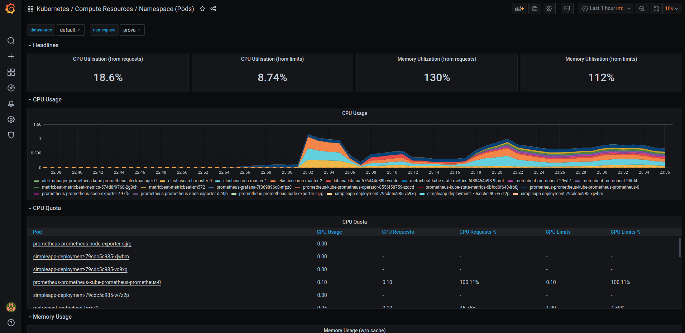
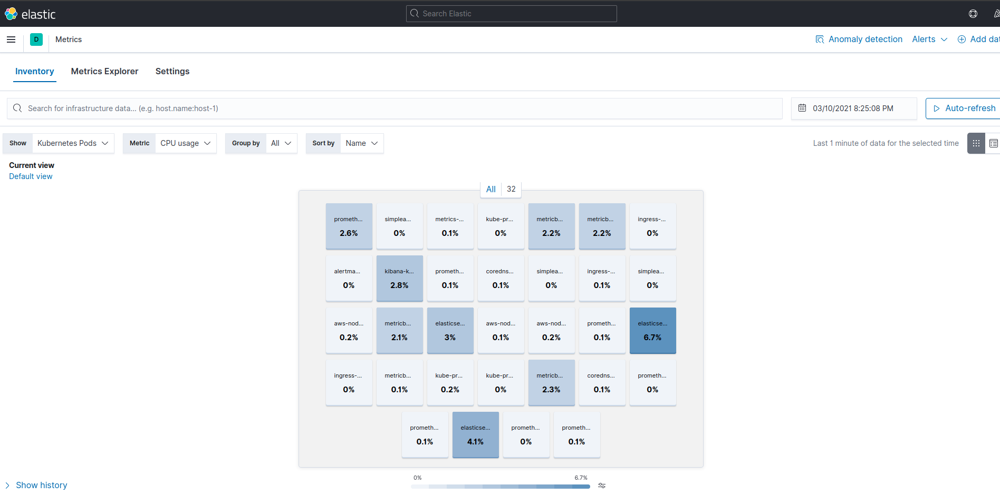
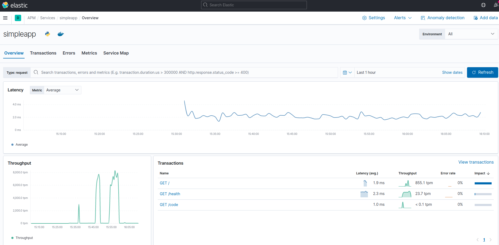
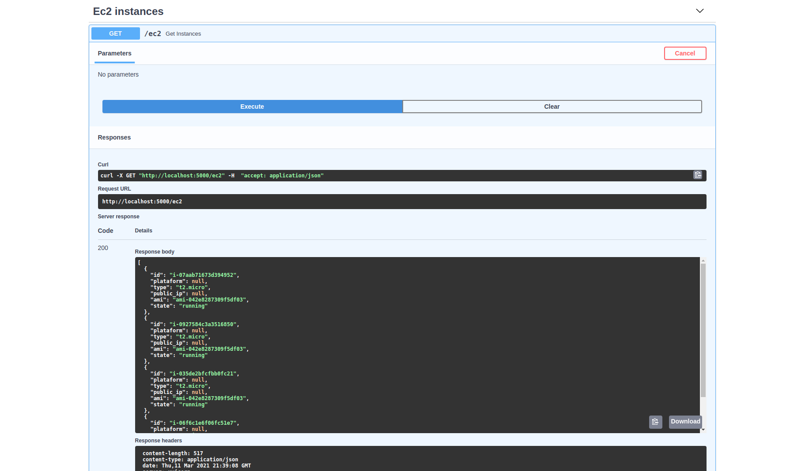

# simpleapp-test


## Deploy IaC

### Terraform:

```bash
## Initiate provider
terraform init
## Apply the modules
terraform apply
```

### Change Kubernetes context:

```bash
aws eks --region us-east-1 update-kubeconfig --name k8s-cluster
```

## Build API Image:

```bash
cd app/
docker build -t duran750/simpleapptest:v1
docker push duran750/simpleapptest:v1
```

## Kubernetes Manifests:

```bash
cd kubernetes/manifests
#Namespace: 
kubectl create -f ns.yaml && \
#ConfigMap:
kubectl create -f simpleapp-cm.yaml && \ 
#Deployment: 
kubectl create -f simpleapp.yaml && \ 
#Service
kubectl create -f simpleapp-svc.yaml && \ 
#Ingress Controller
kubectl create -f challenge-ingress.yaml 
          
```

### K8s Features:


```bash
# Deploy Nginx ingress controller
kubectl apply -f https://raw.githubusercontent.com/kubernetes/ingress-nginx/controller-0.32.0/deploy/static/provider/aws/deploy.yaml


# Deploy metric server
kubectl apply -f https://github.com/kubernetes-sigs/metrics-server/releases/latest/download/components.yaml
```

## Helm

### Install:

```
curl https://raw.githubusercontent.com/helm/helm/master/scripts/get-helm-3 > get_helm.sh
chmod 700 get_helm.sh
./get_helm.sh
```

### Prometheus Stack:

```bash
# Deploy Prometheus + Grafana
helm repo add prometheus-community https://prometheus-community.github.io/helm-charts && \
helm repo update && \
helm install prometheus prometheus-community/kube-prometheus-stack -n prova
```

### ELK Stack:

```bash
cd kubernetes/helm/elk && \
helm repo add elastic https://Helm.elastic.co && \
helm repo update && \
helm install elasticsearch elastic/elasticsearch -n prova -f elastic-values.yaml  && \
helm install kibana elastic/kibana -n prova -f kibana-values.yaml && \
helm install metricbeat elastic/metricbeat -n prova && \
helm install apm-server elastic/apm-server -n prova
```

## EC2 Instances

### Get-ec2 API:

```
# Configure aws access key and secret key
aws configure

cd list_ec2_api/

# To run this script it is necessary to install the Boto3 library and configure aws cli or running in docker using env vars

pip install -r requirements.txt

python3 api/get_ec2.py
```

### Running Get-ec2 with Docker 

`Obs: Set your AWS credentials env's`

```bash
docker run -p 5000:5000 -e AWS_ACCESS_KEY_ID="" \
-e AWS_SECRET_ACCESS_KEY="" \
-e AWS_DEFAULT_REGION=us-east-1 duran750/ec2-api
```

Acess API in http://localhost:5000/ec2 or Swagger in http://localhost:5000/docs

## Samples:

### Grafana dashboard

http://grafana.prova/


*obs: Default grafana user: `admin` and password is `prom-operator`




### Kibana

http://kibana.prova/

#### Cluster metrics


#### APM metrics



### Get EC2 API



## Terraform layout

The Terraform root uses the official community modules for the AWS infrastructure:

- `terraform-aws-modules/vpc/aws` `6.x` for the VPC, public/private subnets, NAT gateway, and subnet tags.
- `terraform-aws-modules/eks/aws` `21.x` for the EKS control plane and managed node group.
- HashiCorp AWS provider `6.x`, locked in `terraform/.terraform.lock.hcl`.

The real AWS deployment is manual and requires AWS credentials plus a configured state backend before applying in a shared environment.

## Validate EKS locally with Floci

Floci provides an isolated AWS-compatible EKS test environment. It uses EKS mock mode, so the test validates Terraform resource creation, AWS API wiring, state refresh, outputs, and cleanup without creating AWS resources.

```bash
cd terraform

docker compose -f docker-compose.floci.yml up -d --wait
cd floci

export AWS_ACCESS_KEY_ID=test
export AWS_SECRET_ACCESS_KEY=test
export AWS_DEFAULT_REGION=us-east-1
export AWS_ENDPOINT_URL=http://127.0.0.1:4566

terraform init -backend=false
terraform validate
terraform plan -var-file=../floci.tfvars.example
terraform apply -auto-approve -var-file=../floci.tfvars.example
terraform output
terraform destroy -auto-approve -var-file=../floci.tfvars.example
```

The Floci root intentionally uses a small `floci-network` module. Floci requires real VPC, subnet, and security-group IDs for EKS operations, but its emulator does not reproduce the full AWS networking behavior of the production VPC module.

The Floci test does not validate kubelet, node bootstrapping, CNI behavior, Helm workloads, or production AWS networking. Use a Kubernetes distribution such as Kind or a real EKS environment for those checks.

## GitHub Actions

- `terraform-ci.yaml` runs Terraform formatting and validation, then applies and destroys the Floci EKS test environment.
- `deploy_terraform.yaml` is manual-only and runs plan/apply against AWS using repository secrets.
